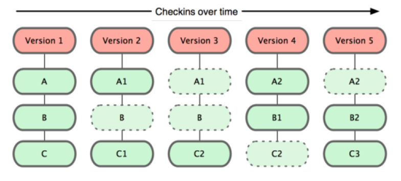
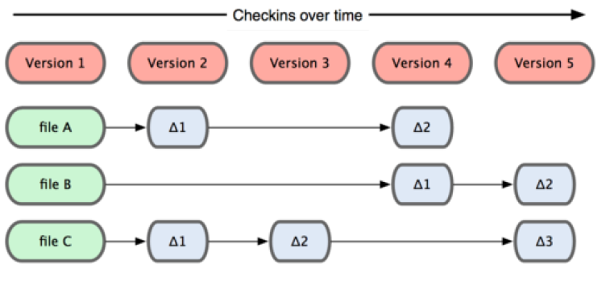
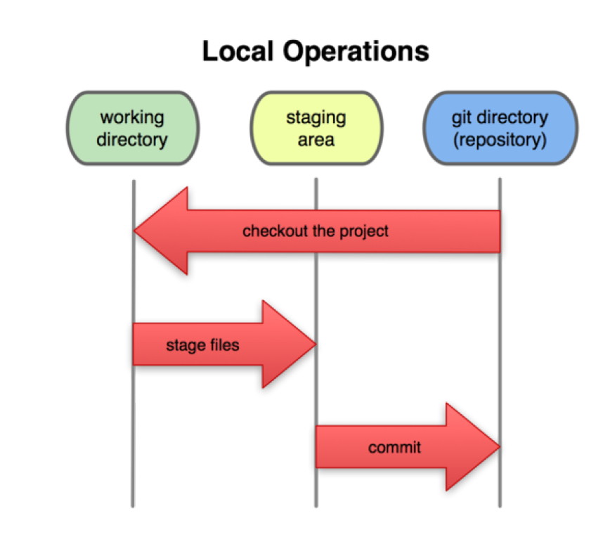

[上一页 Vue项目练习经验](Vue项目练习经验.md)

[上一页 前端开发工具](前端开发工具.md)

# Git 版本控制系统 
  
# 是什么?
``` md 
# Git 版本控制系统是什么? 
  1. 是一种[分布式的 VCS 版本控制系统](VCS_版本控制系统.md)
```
-  [分布式的 VCS 版本控制系统](VCS_版本控制系统.md)

# 为什么?
``` md
# 为什么要使用 Git? 
  1. 是分布式的VCS版本控制系统具有的[分布式和控制](了解不同的版本控制系统及其特点.md)两大特点. 

  2. Git 具有新的更新版本信息的方式, **是通过做快照而不是记录差异**。Git 在进行版本更新的时候, 如果文件数据发生了改变, Git 会**直接进行快照**而非**记录具体差异**. 而非像其余 VCS 版本控制系统, 在进行版本更新的时候, 如果文件数据发生了改变, 它们是记录**具体差异**. 如果没有发生变化, 则只是对上一版本数据做一连接.
```
-  [分布式和控制](了解不同的版本控制系统及其特点.md)

**Git 保存每次更新时的文件快照图解**



**其他系统在每个版本中记录着各个文件的具体差异图解**




# 怎么做?
``` md
# 怎么更好的使用 Git? 
  1. [了解 Git 目录](https://juejin.cn/post/6844903986839945229#heading-0)
  
  2. 了解**Git 工作流程**  

  **工作目录,暂存区域和 git 本地仓库图解** 
  
  

  3. 了解[Git 常用命令](https://www.ruanyifeng.com/blog/2015/12/git-cheat-sheet.html), 管理和维护_Git_仓库.

  4. 了解 **Git 的内部原理**[Git 的内部原理](https://github.com/MuNan-HL/awesome-programming-books-1/tree/master/git)
```
-  [了解 Git 目录](https://juejin.cn/post/6844903986839945229#heading-0)

-  [Git 常用命令](https://www.ruanyifeng.com/blog/2015/12/git-cheat-sheet.html)

-  [Git 的内部原理](https://github.com/MuNan-HL/awesome-programming-books-1/tree/master/git)
