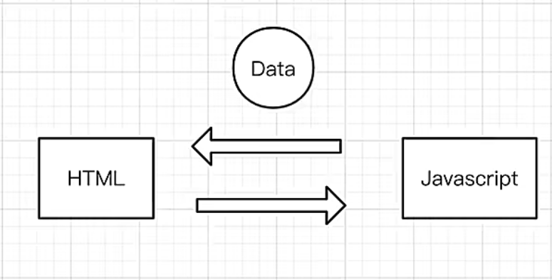

[上一页 README](README.md)

# Vue3
``` md
## Vue3 是什么？
> 1. 一个 Web 前端框架

> 2. 
```

``` md
## 为什么使用 Vue3？
> 1. 因为 Vue2 已经不在维护了 

> 2. 
```

``` md
## 怎么使用 Vue3？
> 1. 看视频学习，多练习

> 2. 
```

``` md
## Vue3 对比 Vue2 的变动是什么？Vue3 和 Vue2 的区别是什么？
> 1. `代码组织方式`的角度，Vue3 是趋向于面向函数编程，即组合式 api。但是 Vue2 的代码组织趋向于面向对象编程，即选项式 api。

> 2. `软件工程`的角度，Vue3 相比于 Vue2 更加易于维护。

> 3. `响应式对象`的角度，封装响应式对象的方法发生了改变。(data 选项转换为了 ref() 和 reactive() 方法)
```

``` md
## 前端发展
> 1. 由 `DOM驱动` 转化为 `数据驱动`

> 2. 
```

``` md
## 前端中常说的渲染是什么？
> 1. 渲染就是指 数据 结合 HTML、CSS、JS 的过程。

> 2. 
```

``` md
## 如何理解 前端渲染 和 服务端渲染？
> 1. 本质区别在于 数据 在那里结合。

> 2. 
```

``` md
## H5 是什么？
> 1. 就是 HTML5，是一种用于搭建网页结构的标记语言。
> 2. 
```

``` md
## Vue 的缺点是什么？
> 1. 使用 Vue 框架，对于网站的 SEO 不够友好，因此不太适合 门户网站 的开发。

> 2. 
```

``` md
## 如何理解 Vue 中提及的双向数据流？
> 1. 如图


> 2. （JS <=== data ===> HTML）
```


``` md
## 双向数据绑定是什么？
> 1. 是响应式数据的双向数据流。（JS[data] <=== data ===> HTML[data]）

> 2. 
```

``` md
## 单向数据绑定是什么？
> 1. 是响应式数据的单向数据流。（JS[data] === data ===> HTML[data]）

> 2. JS 中的数据发生改变，会体现在 HTML 中，才叫 单向数据绑定。

> 3. 
```

``` md
## Vue 中的响应式对象是什么？
> 1. 是 Vue 中实现数据绑定的基础。

> 2. 
```

``` md
## Vue3 中的 v-model 指令和 Vue2 中的 v-model 一样吗？
> 1. 不一样，前者只是实现了双向数据流，但是后者为一个语法糖，即实现了双向数据流，有进行了数据绑定。

> 2. 
```

``` md
## Vue 中的名词使用规范（便于记忆和理解以及沟通）
> 1. 去声明一个常量

> 2. 去声明一个变量

> 3. 去声明一个函数

> 4. 去监听一个点击事件

> 5. 去发射一个自定义事件

> 6. 进行双向数据通信

> 7. 进行双向数据绑定

> 8. 去封装一个响应式对象

> 9. 响应式数据单向数据绑定

> 10. 响应式数据双向数据绑定

> 11. 
```

``` md
## Vue3 中的 setup() 函数是什么？
> 1. 
```

``` md
## 在 Vue3 中什么时候要使用响应式对象什么时候用非响应式对象
> 1. 判断当前的数据是不是要响应式数据，需要响应式对象

> 2. 
```

``` md
## 在 Vue3 中数据绑定的结果是什么？
> 1. 数据会变成响应式数据

> 2. 
```

``` md
## JS 中对象的 getter是什么？
> 1.  箭头函数，用于监听对象中的一个属性。

> 2. 
```

``` md
## 不服复用的代码有必要封装为一个组件吗？
> 1. 有必要，因为封装组件一者是为了可复用，其次是为了单一原则。

> 2. 
```

``` md
## webpack 是什么？
> 1. 一种打包工具

> 2. 
```