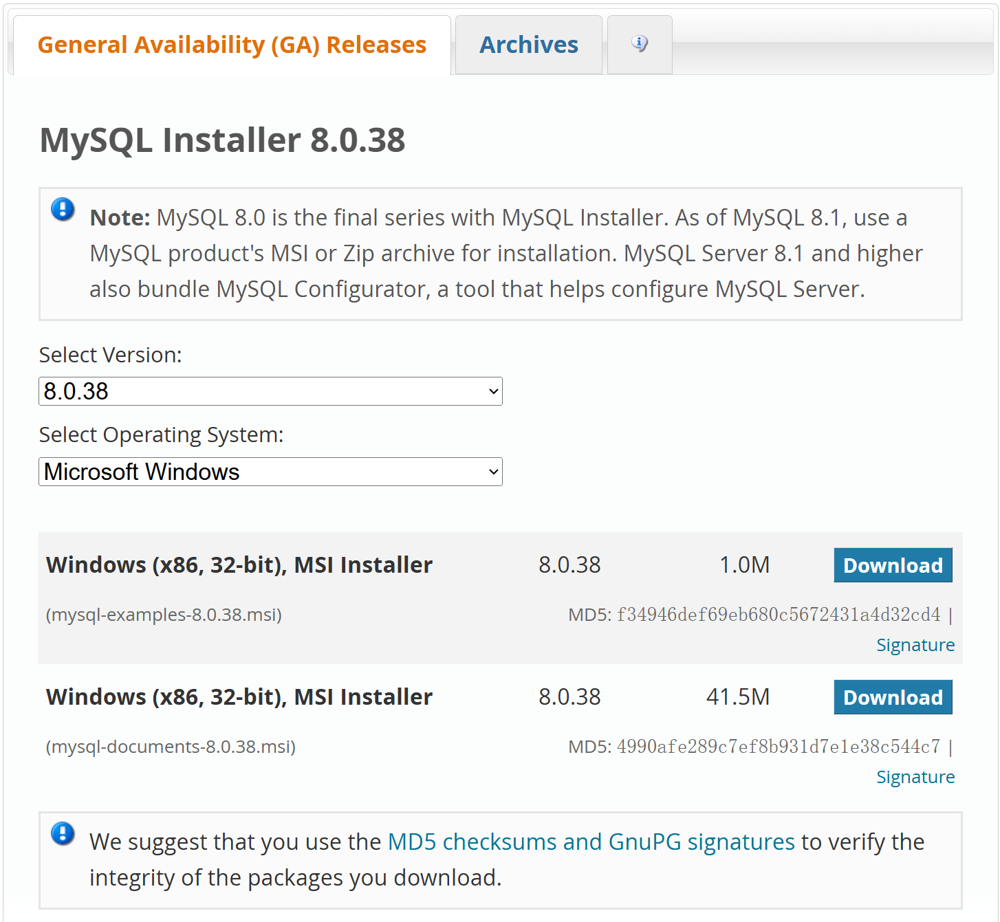
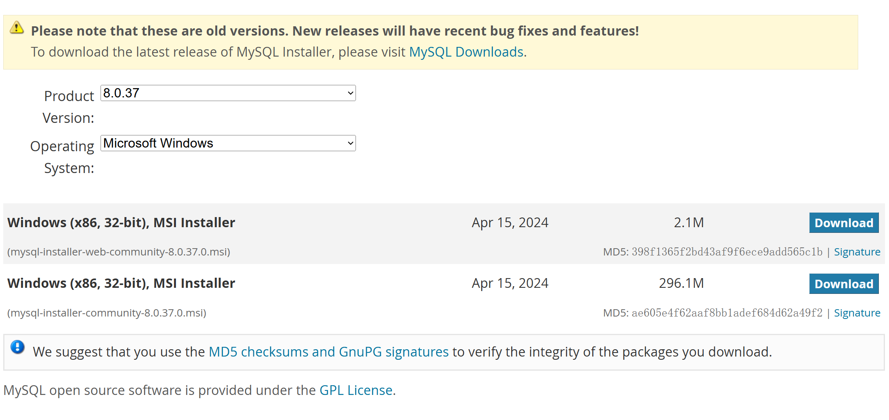
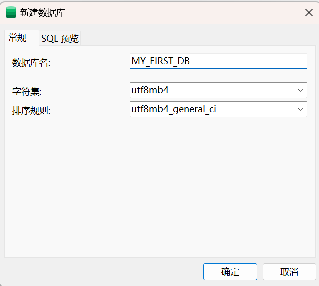

[上一页 README](README.md)

# java 前期配置
``` md
## jdk 的选择？
> 1. 如果不知道选择哪个版本，推荐安装 jdk8。

> 2. 
```

``` md
## jdk 是什么？
> 1. 
```

``` md
## jdk 下载完毕后，如何安装？
> 1. 参考资料 百度网盘 Java 全栈视频

> 2. 
```

``` md
## jdk 安装的注意事项
> 1. 版本的选择

> 2. 注意 jdk 和 jre 的安装

> 3. 安装失败后的重新安装，需要注意不可以直接删除文件夹，去搜教程看如何删除，防止后续安装报错。

> 4. 
```

``` md
## maven 如何安装？
> 1. 参考资料 百度网盘 Java 全栈视频

> 2. 单独安装或者使用 idea 内置的 maven，因此直接按照 idea 即可

> 3. 
```

``` md
## maven 是什么？
> 1. 一个项目依赖包管理工具

```

``` md
## maven 按照注意事项
> 1. 如果使用 idea 开发工具的话，不需要单独安装 maven，因为其内置了 maven。

> 2. 
```

``` md
## idea 如何安装？
> 1. 参考资料 百度网盘 Java 全栈视频

> 2. 
```

``` md
## 如何开始 Java 项目的开发？
> 1. 该项目是新项目还是旧项目？

> 2. 新项目，直接在 idea 中初始化一个 springboot 的项目进行开发

> 3. 旧项目，拿到该项目的代码后，导入 idea 中进行开发即可

> 4. 参考资料 百度网盘 Java 全栈视频
```

``` md
## springboot 是什么？
> 1. 
```

``` md
## 怎么安装 MySQL？
> 1. 参考资料 百度网盘 Java 全栈视频

> 2. 一键安装包

> 3. 注意此时点击 archives 去下载以前版本中的最新版
```
  
``` md
> 如下图，选择 (mysql-installer-community-8.0.37.0.msi) 离线版本
```
  


``` md
## MySQL 是什么？
> 1. 一个数据库管理系统

> 2. 
```

``` md
## 配置环境变量是为了什么？
> 1. 为了 windows 的命令行可以运行 mysql 命令

> 2. 因此配置环境变量本质是配置 path 路径，引导系统找到对应的命令行，所有在 path 中你可以直接输如路径，也可以输入 Windows 系统的变量。%MYSQL_HOME%\bin，本质就是给命令行配一个路径。

> 3. 
```

``` md
## 如何启动 mysql ？
> 1. 我的电脑，右键，管理，选择服务，MYSQL，选择启动

> 2. 
```

``` md
## 安装可视化数据库管理工具
> 1. 安装 navicat

> 2. [参考资料 破解版](https://www.itqaq.com/index/610.html)

> 3. 
```
- [参考资料 破解版](https://www.itqaq.com/index/610.html)

``` md
## 通过 navicat 连接到 MYSQL 数据库管理系统？
> 1. 首先需要确保 MYSQL 以及启动，然后通过 navicat 连接即可

> 2. 
```

``` md
## 连接到 MYSQL 数据库管理系统后，新建一个数据库
> 1. 在新建连接处，右键，选择新建数据库接口，字符集以及排序规则（按中文排序）如下


```


``` md
## 如何新建一个数据库？
> 1. 首先通过数具据库可视化管理工，连接到 MySQL 数据库管理系统，然后新建数据库。

> 2. 
```

``` md
## 如何新建数据表和字段？
> 1. 参考资料 百度网盘 Java 全栈视频

> 2. java 全栈 阶段二 14 1-5

> 3. 
```

``` md
## navicat 如何导入数据库？
> 1. 

``` md
## 
> 1. 
```

``` md
## 了解 JSP 和 ASP
> 1. 
```

``` md
## 了解 ssh 和 ssm 以及 ORM 是什么
> 1. 

```

``` md
## 动态语言和静态语言
> 1. 

```

``` md
## java 的历史
> 1. 

```

``` md
## springboot 是什么？
> 1. 

```

``` md
## java 中的接口是什么？
> 1. 
```

``` md
## 如何通过 idea 创建一个新的 springboot 项目？
> 1. 通过 idea 开发 springboot 项目

> 2. 通过 springboot 官网构建项目

> 3. 通过 maven 构建
```
- [参考链接 idea2023 初始化 springboot 项目](https://blog.csdn.net/qq_44231797/article/details/134630733)

- [idea 解决一直卡在 resolve maven dependence 的问题](https://blog.csdn.net/weixin_45371233/article/details/122676273)


``` md
## 如何进行 web 的后端开发？
> 1. 选择开发语言 - java

> 2. 搭建 java 的 web 开发开发框架 springboot

> 3. 
```

``` md
## pom.xml 是什么？
> 1. maven 的配置文件

> 2. 
```

``` md
## 开发工具的版本选择？
> 1. 不一定追求最新，而是追求稳定

> 2. 

```

``` md
## application.yml 文件是什么？
> 1. 是 springboot 项目的配置文件

> 2. 
```

``` md
## pom.xml 文件是什么？
> 1. maven 的配置文件

> 2. 
```

``` md
## 如何通过 idea 运行 springboot 项目？
> 1. 在项目的入口文件处运行

> 2. 
```

``` md
## 了解 springboot 项目的目录结构
> 1. 
```

``` md
## springboot 的注解是什么？
> 1. 
```

``` md
## java 如何进行调试？
> 1. 打断点后进行 debugger 即可

> 2. 
```

``` md
## 如何进行接口测试？
> 1. 安装 postman 接口测试工具

> 2. 
```

```` md
## springboot 如何配置热重启？
> 1. 安装依赖包 devTools

> 2. idea 配置自动编译功能

> 3. 
```

``` md
## springboot 的 restFul 风格的注解是什么
> 1. 

```

``` md

```