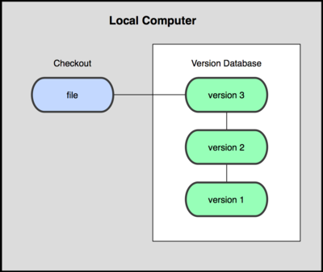
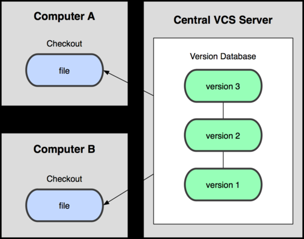
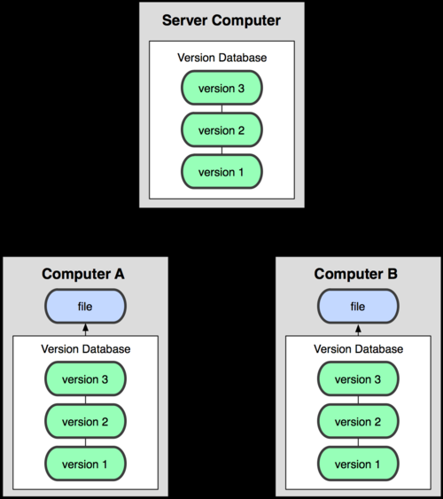

[上一页 VCS_版本控制系统](VCS_版本控制系统.md)

[上一页 Git_版本控制系统](Git_版本控制系统.md)

``` md
# [参考资料 推荐书籍](https://github.com/MuNan-HL/awesome-programming-books-1/tree/master/git)
```
-  [参考资料 推荐书籍](https://github.com/MuNan-HL/awesome-programming-books-1/tree/master/git)

# 本地版本控制系统 
``` md
  [本地版本控制系统图解]

  
``` 


``` md
#  本地版本控制系统是什么? 
  是一种采用**某种简单的数据库**来记录文件的历次更新差异
```  

``` md
# 为什么需要本地版本控制系统?
  为了解决, 由于有时候会混淆所在的工作目录，弄错了文件丢了数据, 导致没了后退的路这一问题. [为什么需要VSC版本控制系统](VCS_版本控制系统.md)
```
-  [为什么需要VSC版本控制系统](VCS_版本控制系统.md)

``` md
#  怎么用本地版本控制系统? 
  例如 RCS
```

# 集中化的版本控制系统
``` md
  [集中化的版本控制系统]

  
```


``` md
#  集中化的版本控制系统是什么? 
  是一种使用一个**单一的集中管理的服务器**，保存所有文件的修订版本，而协同工作的人们都通过客户端连到这台服务器，取出最新的文件或者提交更新。
```

``` md
# 为什么需要集中化的版本控制系统? 
  为了让在不同系统上的开发者**协同工作**
```

``` md
#  集中化的版本控制系统怎么用? 
  例如 CVS，Subversion 以及 Perforce 等
```

# 分布式版本控制系统
``` md
  [分布式版本控制系统]

  
```


``` md
#  分布式版本控制系统是什么? 
  是分布式的控制版本数据的. 会是把原始的代码仓库**完整地镜像**下来, 而不是简单的**提取最新版本的文件镜像**。这么一来，任何一处协同工作用的服务器发生故
  障，事后都可以用任何一个镜像出来的本地仓库恢复。因为每一次的提取操作，实际上都是一次对代码仓库的完整备份.
```

``` md
# 为什么需要分布式版本控制系统?
  为了解决**集中管理服务器可能产生的单点故障**, 从而导致的**数据丢失**或者对版本的**控制无效**的问题.
```

``` md
# 怎么用分布式版本控制系统? 
  例如 **Git**，Mercurial，Bazaar 还有Darcs 等
```
