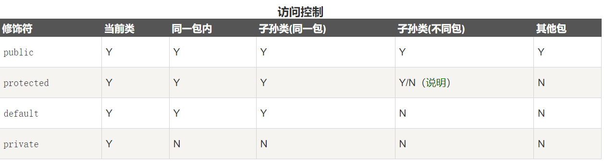
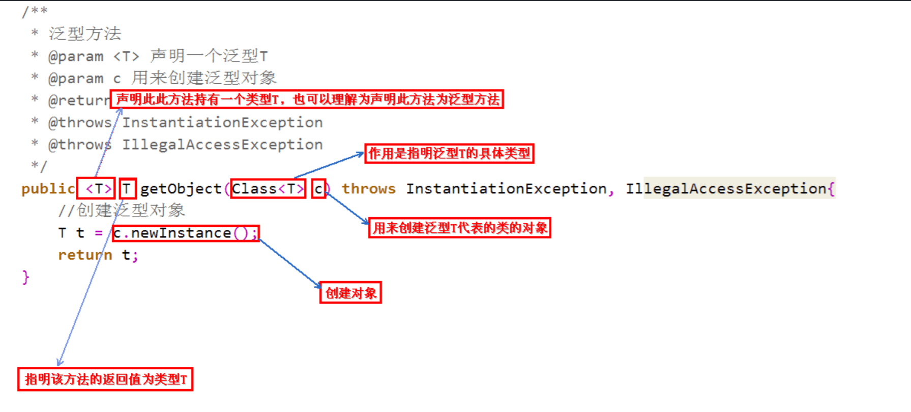
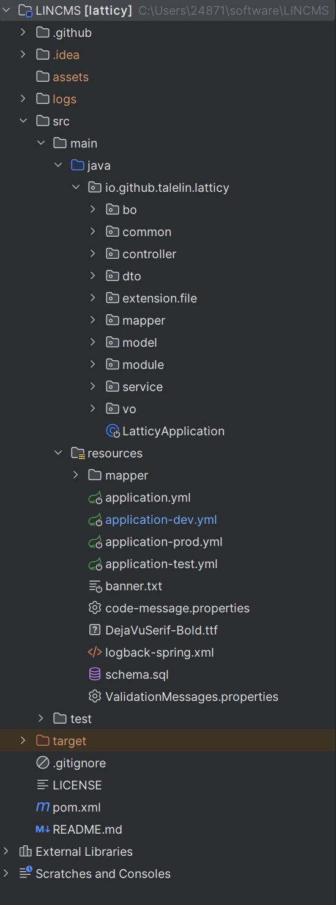

[上一页 README](README.md)

# 进行 Web应用程序 后端开发
## 进行 Web应用程序 后端开发需要掌握的 技术栈
``` md
> 1. java 语言（高级编程语言）

> 2. springboot 框架（应用程序开发框架）

> 3. MVC 模式（应用程序开发模式）

> 4. Web 系统（大型的客户端服务器系统）

> 5. MySQL 数据库管理工具（数据库管理工具）

> 6. ORM 框架（对象关系映射框架）

> 7. MyBatis 框架（一种 ORM 框架的实现）

> 8. MyBatis Plus 框架（一种 ORM 框架的实现）
```

## Web 相关问题
``` md
> 1. Web 是什么？
- 一个巨型的客户端/服务端系统

> 2. 
```

## java 相关问题
- [参考资料 菜鸟教程](https://www.runoob.com/java/java-tutorial.html)

- [参考资料 Java 编程思想一书]()
``` md
> 1. Java 是什么？
- 可维护、可跨平台的编程语言

> 2. Java 中的基类和导出类是什么？
- 基类和导出类的概念源于 UML 中的类图，classA extends classB，则 classA 为导出类（子类），classB 为基类（父类）。

> 3. Java 中的继承是什么？
- 子类 可以继承 父类的属性和方法。注意：子类必须重写父类的构造函数。

> 4. Java 中的容器是什么？
- 一个存储类的实例的 集合

> 5. Java中的 单根继承结构是什么？
- java 中所有类都继承自一个基类即Object。注意：在 Java 中类的继承为单继承，即一个类只能继承一个父类。（这和单根继承并不冲突。）
```

- [参考资料 基类 和 导出类](https://www.cnblogs.com/shindo/p/5579191.html)

- [参考资料 继承](https://www.runoob.com/java/java-inheritance.html)

- [参考资料1 单根继承](https://www.cnblogs.com/hite/p/12905538.html)

- [参考资料2 单根继承](https://juejin.cn/post/6844903733206188045)


``` js
> 6. Java 中的类是什么？
- 是对现实世界的抽象，是一种复杂数据类型，你可以通过 class 关键字声明一个类。每个类都会具有自己的属性和方法。如下：
  // 声明 programmer 类
  class programmer {

    // 构造函数
    programmer(){
      System.out.println("构造函数");
    }

    // 声明一个共有的属性
    public String str;

    // 声明一个共有的方法
    public void do(){
      System.out.println("声明一个共有的方法");
    }
  }

  // 实例化 programmer 类
  // 通过 new 加 programmer() 类的构造函数实例化一个 programmer 类，在通过 programmer 类声明一个 hl 变量 去存储这个类的实例。
  programmer hl = new programmer();
```
- [参考资料 类](https://www.runoob.com/java/java-inheritance.html)

``` md
> 7. Java 中的数据类型有哪些？
- 简单数据类型：字符型、布尔型、整型、浮点型

- 复杂数据类型：数组、类、对象

> 8. Java 中的对象是什么？
- 是 类的实例。注意：你可以通过 class 关键字声明一个类，在通过 类 声明一个变量用于存储类的实例，通过 new 关键字和构造函数实例化一个对象。

> 9. Java 中的常用关键字有哪些？
- class 关键字用于声明类

- extends 关键字用于声明继承、

- static 关键字用于声明一个属性或者方法为静态属性或者方法。

- final 关键字用于声明一个类或者其属性和方法为最后的结果。注意：final 关键字通常和 static 关键字一起使用来创建类常量。

- abstract 关键字用于声明一个类为抽象类。

- default(不写就是 default)、private、public、protect 关键字用于声明访问权限。
```
- [参考资料 对象](https://www.runoob.com/java/java-object-classes.html)

- [参考资料 关键字](https://www.runoob.com/java/java-modifier-types.html)



``` md
> 10. 如何运行你的第一个 Java 代码？
- 安装 idea 代码编辑器。

- 通过 idea 安装 jdk 软件，即 java development kit。

- 进行代码编辑，通过 idea 运行代码。

> 11. Java 的注释风格是什么？

> 12. Java 的命名规范是什么?
- 类名使用大驼峰，属性和方法名使用小驼峰。

```
- [参考资料 Java 注释](https://ericfu.me/javadoc-coding-standards/)

- [参考资料 Java 注释](https://www.runoob.com/java/java-comments.html)

``` md
> 13. Java 中的操作符有那些？
- = 赋值操作符 表示将右边的值赋值给左边的 变量||常量。

> 14. Java 中控制代码执行流程的方法是什么？
- 顺序结构、循环结构、条件结构

> 15. Java 如何将 long 长整型 转换为 int？
- 通过强制类型转换：(int) iPage.getTotal(); 注意：(Integer) iPage.getTotal() 是不行的。因为 long 和 Long 不一样，因此 int 和 Integer 也不一样。

> 16. Java 中的 Long 和 long 不一样吗？
- long 是基本数据类型，Long 是引用数据类型（是 long 的包装类）

> 17. Java 中的包装类是什么？
- 就是一个类，不过这个类，包装了其对应的基本数据类型以及一些常用方法，以便对数据进行操作。因此叫做包装类。

> 18. Java 中的 装箱和拆箱是什么？
- 就是基本数据类型 和 包装类 直接的互相转化。

- 装箱：基本数据类型转换为包装类。

- 拆箱：包装类转换为基本数据类型。

> 19. Java 中的 == 和 equals 的区别是什么？
- 本质上 equals 就是 ==，但是类一开始都重写了 equals。导致 equals 只比较 值 是否相等。而 == 对基本数据类型比较的是 值，对引用数据类型比较的是 引用地址。
```
- [参考资料 long 和 Long](https://blog.51cto.com/gomic/1375582)

- [参考资料 包装类、装箱、拆箱、自动装箱、自动拆箱](https://juejin.cn/post/7107045767721779213)

- [参考资料 == 和 equals](https://developer.aliyun.com/article/1169773)

``` md
> 20. Java 中的 泛型 是什么？
- Java 中的泛型本质是指 **泛化参数的数据类型** 即多种数据类型执行相同的代码。注意：Java 中的泛型是 伪泛型，也就是会在编译阶段进行 类型擦除，将所有的泛型表示（尖括号中的内容）都替换为具体的类型。

- 泛型分为 泛型类、泛型方法、泛型接口。

  - 泛型类 class Point<T>{}

  - 泛型接口 interface Info<T>{}
```
- 

- [参考资料 泛型](https://pdai.tech/md/java/basic/java-basic-x-generic.html)


## MVC 相关问题
``` md
> 1. MVC 是什么？
- 是一种 Web 应用程序的开发模式，即 model-view-controller（模型-视图-控制器）分层模式。

- model 数据模型层负责处理数据和业务逻辑、view 视图层负责给用户展示数据、controller 控制器层用于控制 model 层和 view 层的数据和业务逻辑。

> 2. MVC 开发模式如何实践？
- 推荐学习 lin-cms 项目的 Web 后端开发代码或者其他的好的 MVC 模式实践的项目。

> 3. 
```
- [参考资料 MVC](https://www.runoob.com/design-pattern/mvc-pattern.html)

## springboot 相关问题
``` md
> 1. springboot 是什么？
- 是基于 spring framework 的应用程序开发框架。

- 2. 如何使用 springboot 进行开发？
- 推荐项目 lin-cms web 后端开发。
```
- [参考资料1 springboot](https://www.cainiaoplus.com/springboot/springboot-tutorial.html)

- [参考资料2 2springboot](https://www.ibm.com/cn-zh/topics/java-spring-boot)

- [如何使用 springboot 进行开发](如何使用springboot进行开发.md)

``` md
> 3. 在 MVC 开发模式 和 springboot 开发框架下的，代码目录结构是什么？ 
- 如下：
```


- [参考资料 MVC 开发模式 和 springboot 开发框架下的，代码目录结构]()

``` md
> 4. idea 如何启动程序？
- 首先找到程序入口文件，在右上角菜单栏处，选择 Run Run 运行文件，具体操作你需要自己更具你的 idea 版本进行变通。

> 5. springboot 中的注解是什么？
- 是一种元数据形式，可提供有关程序的补充信息。

> 6. springboot 的常用注解有那些？（根据使用情况不断补充）
> **spring 注解** 
- @Autowired 注解，**容器进行自动装填**，spring 容器会根据匹配到的数据类型进行自动装填。

> **spring framework 注解** 
- @Component 注解，**容器进行自动拾取**，spring 容器会自动拾取添加该注解的类，并将其标记为一个 bean。

- @Controller 注解，声明该类属于控制层。 

- @Service 注解，声明该类属于服务层。

> **springboot 注解**
- @RequestMapping 注解，用于映射网络请求。

- @GetMapping 注解，用于映射 get 方法的网络请求。

- @PostMapping 注解，用于映射 post 方法的网络请求。

- @ResponseBody 注解，用于序列化控制层 return 的数据为 JSON 格式和 XML 格式。

- @PathVariable 注解，用于从网络请求中提取路径中的变量。

- @RequestParam 注解，用于从网络请求路径中提取查询参数。

- @RestController 注解， @Controller 和 @ResponseBody 注解的结合。

> 6.1 进行网络请求映射的时候，资源路径如何命名？
- 控制器类的网络请求映射的资源路径，根据控制层的目录和控制器类的名称进行命名。

- 控制器类中的方法的网络请求映射的资源路径，通过该方法实的名称进行命名。
```
- [参考资料 springboot 注解](https://www.cainiaoplus.com/springboot/springboot-annotations.html)

``` md
> 7. maven 是什么？
- 是一个包管理工具，依据 pom 进行管理。

> 8. 在 MVC 开发模式 和 springboot 开发框架下，如何进行**简单的 CRUD 增删改查的接口开发**？
- 参考资料 百度网盘 Java 全栈课程，以旧有项目为例：（如果是新项目，则需要首先搭建 CMS 系统）
**前期准备**
- 首先，获取旧有项目，保证可以成功运行该项目。配置数据库配置文件，连接到数据库。或者配置 maven 配置文件，或者应用程序配置文件。

- 然后，浏览项目目录结构，熟悉业务逻辑，进行编程设计。

**简单的 CRUD 增删改查业务开发流程**
- MVC 开发模式下，接口的开发流程：

- 首先，在 controller 层，编写控制器类，控制给 view 层返回的数据。

- 然后，在 service 层中，编写 service 类，进行业务处理。

- 然后，在 mapper 层中，编写 mapper 接口，进行数据处理。

- 然后，在 model 层中，编写 model 类，进行 数据表 和 DO 的映射。

- 然后，在 resource 中的 mapper 下，编写 mapper.xml 文件，进行 ORM 映射。

> 9. ORM 是什么？
- ORM 是 Object Relational Mapping 的缩写，译为“对象关系映射”框架。

- 例如 MyBatis、JPA等

> 10. DO 类中的 DO 是什么？
- DO（ Data Object）：与数据库表结构一一对应，通过DAO层向上传输数据源对象。
```
- [参考资料 DO、DTO、BO、AO、VO、POJO定义](https://www.cnblogs.com/EasonJim/p/7967999.html)

``` md
> 11. Java 中的 jbdc 是什么？
- 是Java DataBase Connectivity的缩写，它是 Java 程序连接数据库的标准接口。
```
- [参考资料 JBDC](https://www.liaoxuefeng.com/wiki/1252599548343744/1305152088703009)

## MySQL 相关问题
``` md
> 1. MySQL 是什么？
- 一种数据库管理系统

> 2. 
```

## ORM 相关问题
``` md
> 1. ORM 是什么？
- 是对象关系映射框架，用于将数据库中的表映射为 DO 类。

> 2. 常用的 ORM 框架有那些？
- MyBatis、MyBatis_Plus、JPA 等
```

## MyBatis 相关问题
``` md
> 1. MyBatis 是什么？
- 一种半自动的 ORM 框架。MyBatis 把 DO 详细操作交给了开发者自己。MyBatis 需要自己编写 SQL 去操作 DO。而 JPA 可以不写 SQL 直接操作 DO。

> 2. 如何通过 MyBatis 进行对象关系映射？
- 通过编写 resource 文件下的 mapper 中的 .xml 文件。
```
- [参考资料 ORM](https://www.yijiyong.com/framework/orm/01-intro.html)

``` java
> 3. 如何编写 mapper.xml 文件？
/**
 * 编写格式如下：
 * mapper 标签进行 mapper 接口映射
 * resultMap 标签进行 model 类映射
 * select 标签编写 SQL 查询语句
 * insert 标签编写 SQL 插入语句
 */
<?xml version="1.0" encoding="UTF-8"?>
<!DOCTYPE mapper PUBLIC "-//mybatis.org//DTD Mapper 3.0//EN" "http://mybatis.org/dtd/mybatis-3-mapper.dtd">
// 映射 mapper 映射层的 mapper 映射接口
<mapper namespace="io.github.talelin.latticy.crudDesign.mapper.BannerMapper">

    // 映射 model 数据模型层的 DO 数据对象
    <resultMap id="BaseResultMap" type="io.github.talelin.latticy.crudDesign.model.BannerDO">
        <id column="id" property="id"/>
        <result column="name" property="name"/>
        <result column="title" property="title"/>
        <result column="description" property="description"/>
        <result column="image" property="image"/>
    </resultMap>

    // 编写 查询语句
    <select id="getAllBanners" resultMap="BaseResultMap">
        SELECT *
        FROM banner
    </select>

    // 编写 插入语句
    <insert id="insertBanner" useGeneratedKeys="true" keyProperty="id" parameterType="io.github.talelin.latticy.model.BannerDO">
        INSERT into banner(id, name)
        VALUES (#{id}, #{name})
    </insert>

</mapper>
```

## MyBatis Plus 相关问题
``` md
> 1. MyBatis Plus 是什么？
- 对 MyBatis 的优化，不再需要在有了 mapper 接口之后还要编写 SQL 去操作 DO，可以直接去通过 mapper 接口操纵 DO，进行 CRUD 创建、读取、更新、删除。

> 2. CRUD 是什么？
- CRUD 是指软件应用程序能够执行的四种基本操作——创建、读取、更新和删除。
```
- [参考资料 CURD](https://www.freecodecamp.org/chinese/news/crud-operations-explained/)

``` md
> 3. 使用 MBatis Plus 怎么设计一个接口？
- 首先，在数据模型层，声明 数据对象 类，映射数据表。

- 首先，在控制器层，声明控制器类下，去设计传参格式，查询参数或路径变量，以及返回给 视图层 的数据对象格式。（分页、空、VO）

- 然后，在服务层，声明服务类下，处理业务逻辑，所需数据来源于 映射层 和 数据模型层。

- 然后，在映射层，声明映射接口下，处理数据。

- 然后，根据查询数据的复杂程度，选择是否在 resource 下的 mapper 文件下，编写 XML 文件。
```
``` md
> 4. 
- 
```

## 其他问题
``` md
> 1. 统一响应数据格式
- code message request
```